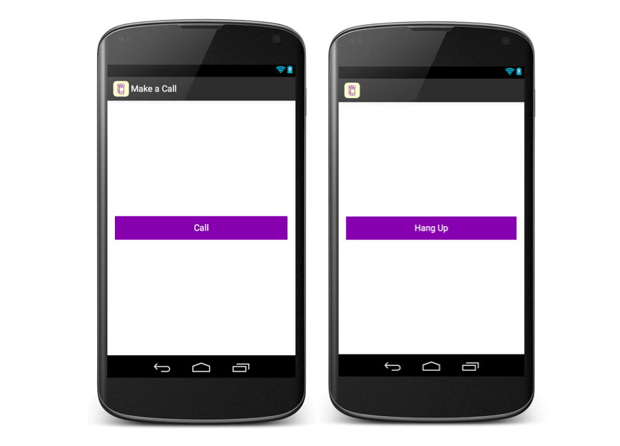
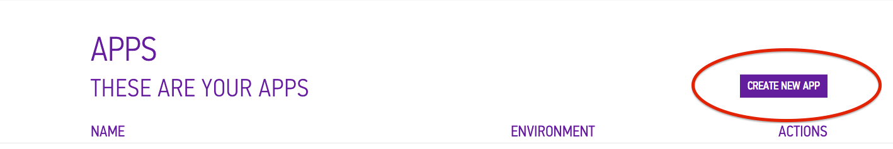
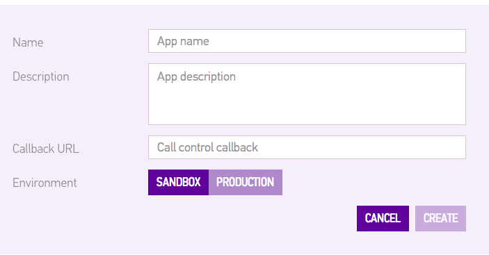
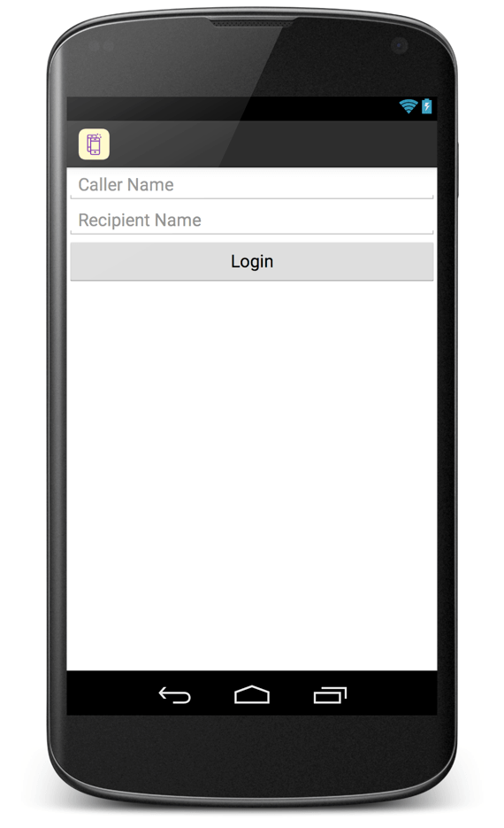

<h1>Build a Simple Android Calling App with Sinch</h1>

This tutorial will walk you through building a very simple Android VoIP calling app. It will look something like this when you are finished:

       
       
The completed source code for this tutorial is available at <a href="http://www.github.com/sinch/app-app-calling-android" target="_blank">github.com/sinch/app-app-calling-android</a>

##Set Up
       
First, you will need to create an new project in Android Studio. (You can use Eclipse if you like, but this tutorial was built and tested in Android Studio.)

 To generate an API key and secret, create an app in the <a href="http://www.sinch.com/dashboard">Sinch Dashboard</a>. Name the app anything you like, and press "create." (You do not need a description or call control callback.)

		

Hold onto the key and secret from this app; you will use them in just a few minutes.

Next, download the Sinch Android SDK from <a href="https://www.sinch.com/downloads/">www.sinch.com/downloads</a>. To add the Sinch SDK to your project:

  <ol>
      <li>Copy the entire libs folder to your project’s root directory.</li>
      <li>Right-click the jar-files and choose ‘Add As Library’.</li>
      <li>Create a new folder under src/main and name it jniLibs.</li>
      <li>Move the armeabi and armeabi-v7a folders into the newly created jniLibs folder.</li>
  </ol>

Lastly, Sinch requires a few permissions. Head over <b>AndroidManifest.xml</b> and add the following:

	<uses-feature
	    android:name="android.hardware.microphone"
	    android:required="false"/>
	
	<uses-permission android:name="android.permission.INTERNET"/>
	<uses-permission android:name="android.permission.RECORD_AUDIO"/>
	<uses-permission android:name="android.permission.MODIFY_AUDIO_SETTINGS"/>
	<uses-permission android:name="android.permission.READ_PHONE_STATE"/>
	<uses-permission android:name="android.permission.ACCESS_NETWORK_STATE"/>

##Make Outgoing Calls

First, create a new xml file, and name it <b>call.xml</b>. Add a simple "Call" button:

	<Button
	    android:layout_width="fill_parent"
	    android:layout_height="wrap_content"
	    android:text="Call"
	    android:id="@+id/button"
	    android:layout_centerVertical="true"
	    android:layout_centerHorizontal="true" />

Now, create a new activity, <b>CallActivity</b>, where your user can make a phone call upon the click of the call button.

Note: <b>In AndroidManifest.xml</b>, you should set

android:screenOrientation="portrait"

for CallActivity. Since onCreate gets called when the screen is rotated, calls will hang up if the screen rotates. Setting the orientation to portrait prevents this from happening.

Back in onCreate, start by creating an OnClickListener:

	Button button = (Button) findViewById(R.id.button);
	button.setOnClickListener(new View.OnClickListener() {
	    @Override
	    public void onClick(View view) {
	       // make a call!
	    }
	});

To make a call, you first need to create an instance of SinchClient:

	SinchClient sinchClient = Sinch.getSinchClientBuilder()
	        .context(this)
	        .userId("current-user-id")
	        .applicationKey("app-key")
	        .applicationSecret("app-secret")
	        .environmentHost("sandbox.sinch.com")
	        .build();

Make sure to fill in app-key and app-secret with the key and secret you generated when creating an app in the dashboard! Then, tell the sinch client that you want to have calling in your app, and finally, start the client:

    sinchClient.setSupportCalling(true); 
    sinchClient.start();

Inside the OnClickListener, you will make the call:

    sinchClient.getCallClient().callUser("call-recipient-id");

To make a test call, you will use the calling sample app included in the SDK for your recipient. Open sinch-rtc-sample-calling in Android Studio, input the same keys you used above, and run the app. Once you log in as "call-recipient-id," this app will be able to receive incoming calls from the app you are currently building. Give it a try!

This app currently provides an awful user experience for the caller. Let's change that. Here is a list of things you will now add:

<ul>
<li>allow the caller to hang up</li>
<li>react accordingly when the call recipient hangs up</li>
<li>let the caller control the volume of the call</li>
<li>let the caller know when the call is ringing</li>
<li>let the caller know when the call is connected</li>
</ul>

To toggle the main button between "Call" and "Hang Up," start by storing the current call:

    private Call call;

Inside the onClickListener, you can make a call or hang up the current call depending on whether or not call is null:

	public void onClick(View view) {
	    if (call == null) {
	        call = sinchClient.getCallClient().callUser("call-recipient-id");
	        button.setText("Hang Up");
	    } else {
	        call.hangup();
	        call = null;
	        button.setText("Call");
	    }
	}

Unfortunately, this only handles the user hanging up. You will also want your app to react accordingly if the recipient hangs up. To track these changes, you will set up a CallListener that can execute code depending on the state of phone call:

    private class SinchCallListener implements CallListener {
        @Override
        public void onCallEnded(Call endedCall) {
            //call ended by either party
        }

        @Override
        public void onCallEstablished(Call establishedCall) {
            //incoming call was picked up
        }

        @Override
        public void onCallProgressing(Call progressingCall) {
            //call is ringing
        }

        @Override
        public void onShouldSendPushNotification(Call call, List<PushPair> pushPairs) {
            //don't worry about this right now
        }
    }

Then, add an instance of SinchCallListener to the current call in your OnClickListener:

	call.addCallListener(new SinchCallListener());

Note: If you're curious about when each of these methods is called, this would be a good time to add some logging output or toast messages in SinchCallListener.

First, since onCallEnded will get called if either party ends the phone call, you can move these two lines from your OnClickListener into onCallEnded:

	call = null;
	button.setText("Call");

Next, you want the volume buttons to control the volume of the phone call while connected. Use the AudioManager provided by Android:

    @Override
    public void onCallEstablished(Call establishedCall) {
        setVolumeControlStream(AudioManager.STREAM_VOICE_CALL);
    }

Then, to have the volume buttons go back to controlling the ringer volume when the phone call is disconnected:

    @Override
    public void onCallEnded(Call endedCall) { 
        setVolumeControlStream(AudioManager.USE_DEFAULT_STREAM_TYPE);
    }

To update the user on the state of the call (ringing, connected), create a textView that will appear above the button:

    <TextView
        android:layout_width="fill_parent"
        android:layout_height="wrap_content"        
        android:id="@+id/callState"
        android:layout_above="@+id/button"
        android:gravity="center_horizontal"
        android:layout_marginBottom="30dp"/>

In onCreate, define the textView:

    callState = (TextView) findViewById(R.id.callState);

Now, you can set the text to "ringing" in onCallRinging, and "connected" in onCallEstablished, and finally to "" in onCallEnded:

	//onCallProgressing
	callState.setText("ringing");

	//onCallEstablished
	callState.setText("connected");

	//onCallEnded
	callState.setText("");

Now your app has a much better user experience for the caller! Try making a call to the SDK sample app that you set up earlier.

##Receive Incoming Calls

For the purposes of this tutorial, your app will automatically accept incoming calls. To start, you want your SinchClient to listen for incoming calls. Add this right before you start the SinchClient:

	sinchClient.startListeningOnActiveConnection();

Now that your app is listening for incoming calls, it should know how to respond appropriately. After you start the SinchClient, add a listener to the CallClient:

	sinchClient.getCallClient().addCallClientListener(new SinchCallClientListener());    

	private class SinchCallClientListener implements CallClientListener {
	    @Override
	    public void onIncomingCall(CallClient callClient, Call incomingCall) {
	        //Pick up the call!
	    }
	}

In onIncomingCall, you will need to do the following:

<ul>
 <li>set current call to incomingCall</li>
 <li>answer the call</li>
 <li>add a call listener to the current call</li>
 <li>set the button text to "hang up"</li>
</ul>

Easy enough, right?

	call = incomingCall;
	call.answer();
	call.addCallListener(new SinchCallListener());
	button.setText("Hang Up");

To test the app now:

<ol>
 <li>Set user id to 'a' and recipient id to 'b' (in your code)</li>
 <li>Run the app on device #1</li>
 <li>Set user id to 'b' and recipient id to 'a' (in your code)</li>
 <li>Run the app on device #2</li>
 <li>Chat away!</li>
</ol>
  
##Add Login
  

In this section, you are going to add a simple login screen so that users can call more than just one person. Your login screen will look like this:

       

       

To set this up, you will need to do the following:

  
<ul>
 <li>Create a new activity, <b>LoginActivity</b></li>
 <li>Create layout for LoginActivity</li>
 <li>Pass callerId and recipientId to CallActivity as intent extras</li>
</ul>
  

Start by creating a new activity, <b>LoginActivity</b>. In the view for this activity, you will need two EditTexts and a login button:

       
	<EditText
	    android:layout_width="match_parent"
	    android:layout_height="wrap_content"
	    android:id="@+id/callerId"
	    android:hint="Caller Name"/>

	<EditText
	    android:layout_width="match_parent"
	    android:layout_height="wrap_content"
	    android:id="@+id/recipientId"
	    android:layout_below="@+id/callerId"
	    android:hint="Recipient Name"/>

	<Button
	    android:layout_width="match_parent"
	    android:layout_height="wrap_content"
	    android:id="@+id/loginButton"
	    android:text="Login"
	    android:layout_below="@+id/recipientId"/>
       

That is all you'll need in the login view. Head back to <b>LoginActivity.java</b> to add an OnClickListener for the login button:

  
	findViewById(R.id.loginButton).setOnClickListener(new View.OnClickListener() {
	    @Override
	    public void onClick(View view) {
	        //start CallActivity
	    }
	});
       

When starting <b>CallActivity</b>, you'll want to pass along callerId and recipientId as string extras:

	  
	EditText callerEditText = (TextView) findViewById(R.id.callerId));
	EditText recipientEditText = (TextView) findViewById(R.id.recipientId);
	String callerId = callerEditText.getText().toString();
	String recipientId = recipientEditText.getText().toString;
	  
	Intent intent = new Intent(getApplicationContext(), CallActivity.class);
	intent.putExtra("callerId", callerId);
	intent.putExtra("recipientId", recipientId);
	startActivity(intent);
       

In <b>CallActivity.onCreate</b>, use Intent.getStringExtra to get callerId and recipientId from LoginActivity:

       
	Intent intent = getIntent();
	callerId = intent.getStringExtra("callerId");
	recipientId = intent.getStringExtra("recipientId");

Now you can use the callerId variable when starting the Sinch client, and recipientId when making a call!

  

If you have any questions, we're always available on Twitter <a href="http://www.twitter.com/sinchdev" target="_blank">@SinchDev</a>. You can also reach us via email at <a href="mailto:dev@sinch.com">dev@sinch.com</a>

